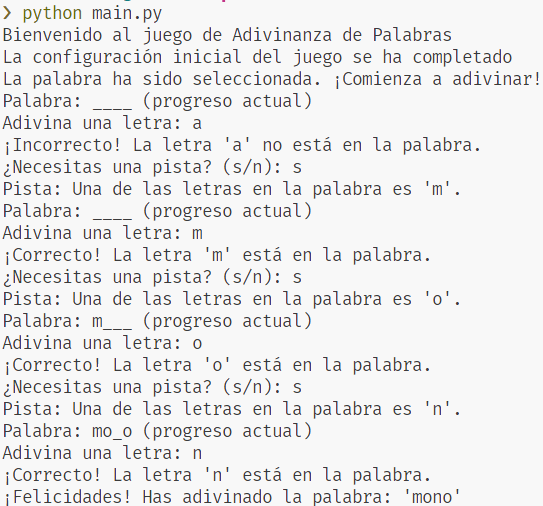

## Desarrollo de software

### Desarrollo Ágil de un Juego de Adivinanza de Palabras Utilizando BDD y Control de Versiones

#### Objetivo de la actividad:
El objetivo de esta actividad es guiar a los estudiantes a través del desarrollo de un <b>Juego de Adivinanza de Palabras</b> aplicando <b>prácticas ágiles de desarrollo</b>. Se enfocará en la implementación de <b>Behavior-Driven Development (BDD)</b> utilizando <b>Gherkin</b> para definir y automatizar pruebas, así como en la <b>gestión de versiones</b> y <b>despliegue</b> del proyecto mediante <b>GitHub</b> y <>bGitHub</b> Actions. Los participantes aprenderán a estructurar el proyecto en sprints, colaborar efectivamente en el desarrollo de funcionalidades clave, y asegurar la calidad y escalabilidad del juego mediante pruebas automatizadas y buenas prácticas de desarrollo.

#### Proyecto: Juego de adivinanza de palabras (Word Guessing Game)

##### Descripción general
En este juego, el jugador debe adivinar una palabra secreta letra por letra. El juego mostrará el progreso del jugador, incluyendo las letras correctas adivinadas y letras faltantes. Se implementarán funcionalidades como selección de palabras, sistemas de pistas limitadas, y control de intentos fallidos.

##### Sprint 1: Configuración de repositorio y flujo de trabajo básico
<b>Objetivo del sprint</b>: Configurar el proyecto en GitHub, preparar la estructura básica del juego, y establecer el flujo de trabajo.

<b>Funcionalidades implementadas:</b>

1. Estructura básica del Juego:

1.1Crear un archivo principal (main.py o WordGame.java).

```shell
    #main.py
    def main():
        print("Bienvenido al juego de Adivinanza de Palabras")
        print("La configuración inicial del juego se ha completado")

    if __name__ == '__main__':
        main()
```

1.2 Añadir un archivo de texto (words.txt) con una lista de palabras para el juego.

```shell
    #words.txt
    leon
    tigre
    elefante
    ballena
    delfin
    perro
    gato
    caballo
    vaca
    mono
    oso
    lobo
    cebra
    jirafa
    murcielago
    rinoceronte
    camello
    canguro
    foca
    liebre
```

1.3 Crear un directorio para futuras funcionalidades, por ejemplo, src/

```shell
    $ Word-Guessing-Game > mkdir src
```

##### Sprint 2: Desarrollo colaborativo y control de versiones
<b>Objetivo del sprint</b>: Implementar las funcionalidades clave del juego, incluyendo la lógica de adivinanza, la selección de palabras aleatorias, y el sistema de pistas.

<b>Funcionalidades implementadas:</b>

1. Selección aleatoria de palabras:

* Función seleccionar_palabra() que selecciona una palabra al azar de words.txt:

En el siguiente código usamos usamos <b>open("./words.txt")</b> para acceder al archivo 'words.txt', con 'readlines()' convertimos el archivo en un vector el cual tendra las palabras secretas, seguidamente usamos el modulo <b>random</b> para acceder al indice de la palabra aleatoria que será escogida, una vez seleccionada la palabra esta sera devuelta sin espacios vacios usando el metodo 'strip()'.

```shell
    # palabraAleatoria
    import random

    def seleccionar_palabra():
        with open("./words.txt") as archivo:
            listaPalabras = archivo.readlines()
            tamañoLista = len(listaPalabras)
            indiceAleatorio = random.randint(0, tamañoLista - 1)
            palabraAleatoria = listaPalabras[indiceAleatorio].strip()
            return palabraAleatoria
```
2. Lógica de adivinanza:

* Función adivinar_letra(letra):

Recibe una letra del jugador y verifica si está en la palabra secreta:

En la adivinar_letra() comprobaremos si la letra ingresada por consola y convertida a minuscula coincide con alguna de las letras de la palabra secreta.
En la función progreso_actual() reemplazaremos '_' con la letra coincidente en la posición correcta de la palabra secreta.

```shell
    # adivinarPalabra
    class AdivinarPalabra:
        def __init__(self, palabra):
            self.palabra = palabra.lower()
            self.letras_adivinadas = set()
        def adivinar_letra(self, letra):
            letra = letra.lower()
            if letra in self.letras_adivinadas:
                return ("Ya has adivinado esa letra. Intenta con otra.")

            self.letras_adivinadas.add(letra)

            if letra in self.palabra:
                return (f"¡Correcto! La letra '{letra}' está en la palabra.")
            else:
                return (f"¡Incorrecto! La letra '{letra}' no está en la palabra.")

        def progreso_actual(self):
            return ''.join([letra if letra in self.letras_adivinadas else '_' for letra in self.palabra])
        
        def todas_las_letras_adivinadas(self):
            return all(letra in self.letras_adivinadas for letra in self.palabra)
```

Controla los intentos maximos restantes:
El jugador tendra 10 intentos para adivinar la palabra secreta.

```shell
    # main.py
    contador_intentos = 0
    while True:
        print(f"Palabra: {juego.progreso_actual()} (progreso actual)")
        letra = input('Adivina una letra: ').lower()

        mensaje = juego.adivinar_letra(letra)
        print(mensaje)

        if juego.todas_las_letras_adivinadas():
            print(f"¡Felicidades! Has adivinado la palabra: '{palabra}'")
            break

        if contador_intentos >= 10:
            print(f"Lo siento, has perdido. La palabra era: '{palabra}'")
            break

        if pistas_dadas < 3:
            condicional = input("¿Necesitas una pista? (s/n): ")
            if condicional.lower() == "s":
                letras = Pistas.obtener_pista(palabra)
                pista = Pistas.dar_pista(letras, juego.letras_adivinadas)
                if pista:
                    print(f"Pista: Una de las letras en la palabra es '{pista}'.")
                    pistas_dadas += 1
                else:
                    print("No quedan más letras para dar como pista.")
        else:
            print("Ya se han dado todas las pistas posibles.")
        contador_intentos += 1
```

3.  Sistema de pistas limitadas:

En el siguiente codigo la funcion obtener_pista() recibe como parametro una palabra secreta obtenida del archivo word.txt, y guarda en la lista letras cada letra sin repeticion de la palabra.
En la función dar_pista() recibe como parametro letras y letras adivinadas esto para tener un registro de que letras ya han sido adivinadas, y se utiliza random.choise para escoger una letra aleatoria de las letras aún no adivinadas.

```shell
    # pistasPalabras.py
    import random
    import string

    class Pistas:
        def obtener_pista(palabra):
            letras = set()
            for letra in palabra:
                if letra.lower() in string.ascii_lowercase:
                    letras.add(letra.lower())
            return list(letras)
        
        def dar_pista(letras, letras_adivinadas):
            letras_no_adivinadas = [letra for letra in letras if letra not in letras_adivinadas]
            if len(letras_no_adivinadas) < 1:
                return None
            pista = random.choice(letras_no_adivinadas)
            return pista
```

#### Prueba en salida de consola:



##### Como ejecutar el programa:

1. Clona el repositorio.
2. Dirigete al directorio del programa.
3. ejecuta el comando:
```shell
    # Para windows:
    $ python main.py

    # Para linux:
    $ python3 main.py
```